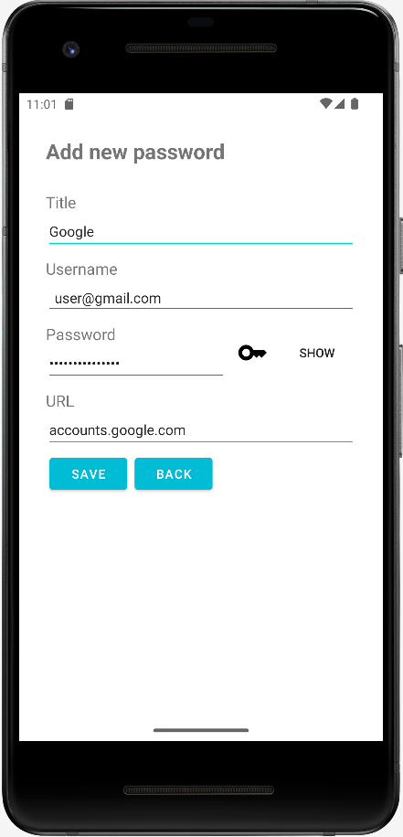
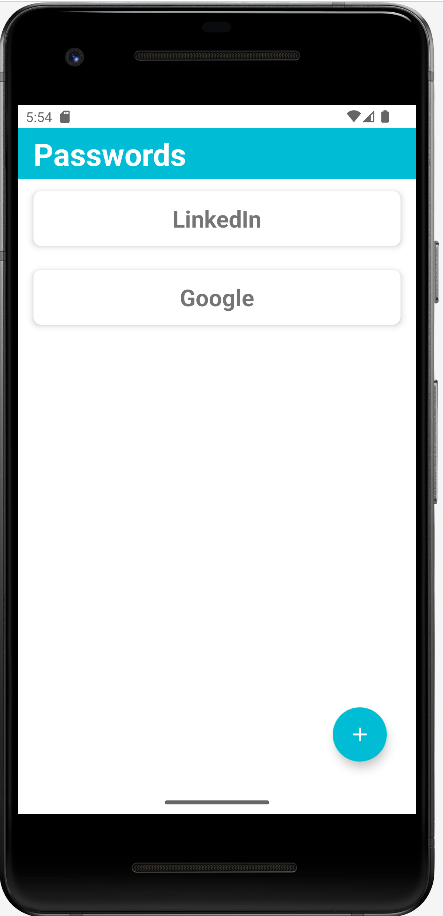
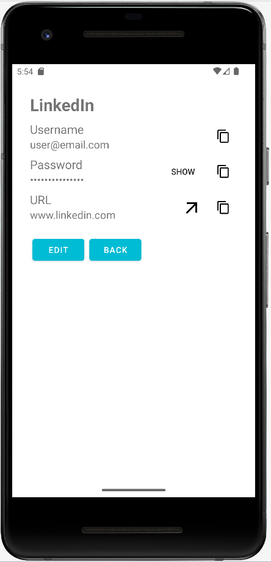

# Password Manager Android App

Password Manager is a free and minimalistic user credentials management with security practices in mind.
You can add, edit and delete your credentials with ease while being secure. You can also generate strong passwords that adhere to security standards and policies. All data is stored locally on your device and is encrypted using AES algorithm. Application does not have any adds and does not require internet connection to function.

> Although my goal is to make fully working free and open-source app, this is just the first version and may not be suitable for everyday use since it lacks some key features such as MFA, sync across devices, browser extensions etc. If you want to help me on my path and/or have some suggestions, read the *Contribute* section.

## Screenshots

## Download 

The app is currently not on the play store, but you have two options to run the app yourself.

1. Clone this repository and run in through the [Android Studio](https://developer.android.com/studio).
2. Download the APK from [Mediafire](https://www.mediafire.com/file/lkr15gpr9ghj8eu/Password_Manager.zip/file). 
	>Installing the APK:
	> 1. Download the .zip file from Mediafire
	> 2. Extract the .zip
	> 3. Click the *app-release.apk*
	> *You will need to enable the installation if you get prompted
	
## Features

-  CRUD (Create Read Update and Delete) - You can add, modify and delete data. Changes cannot be undone.
- Strong password generator - While adding a new set of credentials, or modifying existing ones, you have the option to input your own password, or generate a strong one that adheres to security best practices and regulations. (Generated passwords are consisted of 15 random characters including minimum of each: uppercase and lowercase letters, numbers and special characters).
- AES encryption/decryption - Passwords are encrypted with AES algorithm upon writing to database and decrypted upon reading from database. * I did not figure out how to secure the key better that storing it as a private class variable. I have tried using the Key Store but encountered some problems. (Read contribution section if you want to help
- Database handling - The app uses the SQLite database on your device to store the data.
- UX/UI design - Even though I am not keen on designing interfaces and thinking about user experience, (I care more about brains that the looks) I have incorporated some essential UX/UI features like custom icon, splash screen, toasts, compatibility with Day and Night themes, layout constraints, alerts etc. 

## Technologies

Language used is Java. For database handling I have used SQLiteOpenHelper library and for AES I have used Security and Crypto libraries. I have broken larger scripts into separate functions to make it more readable. Smaller scripts are more textbook approach written. I have written a couple of my own libraries for this project, so I do not repeat myself a lot.

I have not written any tests; I know, I know, my bad... Reason being that I have not, yet, worked with JUnit. Now that I have the grasp of Android dev workflow, I plan on incorporating unit tests, but I do not plan to make this project test driven.

## Contribute

My idea is to make a free and open-source Password Manager app that should be simple and secure. If you want to help and contribute to this repository, feel free to do so. Also, if you encounter any bugs, I would be glad to be informed about them. Some ideas for improvement are, UX/UI, authorization system, device sync, browser extensions, changes history, reverting to changes, getting notified after some time to change passwords...

If you have any ideas and/or questions you can send me an email or DM on LinkedIn.
Email: dselimovic02@gmail.om
LinkedIn: [Denis Selimovic](https://www.linkedin.com/in/denis-selimovic-99357929a/)